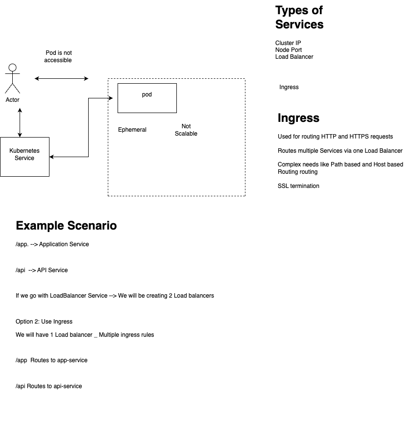

## Service Example


---

## 🔌 CNI: Container Network Interface

* Standard for configuring container networking.
* Kubernetes uses CNI plugins to provide pod-to-pod networking.

### ✅ Why Calico?

* Provides pod networking **and** `NetworkPolicy` support.
* Efficient in implementing **routing and security**.

---

## ⚡ Event-Based Autoscaling

* Automatically scales workloads **based on events**, such as message queue length.
* 🔧 Example: **KEDA**
* ❗ Different from **HPA** (Horizontal Pod Autoscaler) which scales based on CPU/Memory usage.

---

## 🌐 Kubernetes Services: Types & Use Cases

| Service Type | Use Case                                |
| ------------ | --------------------------------------- |
| ClusterIP    | Internal-only access (default).         |
| NodePort     | Expose via static port on each node.    |
| LoadBalancer | Cloud provider-managed external access. |
| ExternalName | Maps service to an external DNS name.   |

### LoadBalancer vs Ingress

* **LoadBalancer:** Exposes a **single** Service externally.
* **Ingress:** Routes **multiple** Services via the **same IP/host** with rules.

---

## 📦 Namespace

* Logical separation of Kubernetes resources.
* Common examples: `dev`, `staging`, `prod`.

---

## 🔐 Network Policies Example

Allow ingress traffic **only** from pods with `app=frontend`:

```yaml
apiVersion: networking.k8s.io/v1
kind: NetworkPolicy
metadata:
  name: allow-frontend
spec:
  podSelector:
    matchLabels:
      app: myapp
  ingress:
  - from:
    - podSelector:
        matchLabels:
          app: frontend
```

---

## 🌍 Why IP Forwarding?

* Enables routing **between pods across nodes**.
* Linux nodes **must allow** packet forwarding for pod networking.

---

## 🔎 Find Which Node a Deployment Is Running On

1. List pods with label:

   ```bash
   kubectl get pods -l app=my-deployment
   ```

2. See detailed info:

   ```bash
   kubectl get pods -o wide
   ```

---

## 🔍 Access etcd

1. List etcd pods:

   ```bash
   kubectl get pods -n kube-system
   ```

2. Exec into etcd pod:

   ```bash
   kubectl exec -n kube-system etcd-<pod-name> -it -- sh
   ```

3. View keys using `etcdctl`:

   ```bash
   ETCDCTL_API=3 etcdctl --endpoints=https://127.0.0.1:2379 \
     --cert=/etc/kubernetes/pki/etcd/server.crt \
     --key=/etc/kubernetes/pki/etcd/server.key \
     --cacert=/etc/kubernetes/pki/etcd/ca.crt \
     get / --prefix --keys-only
   ```

---
## Kubernetes Cluster setup on EC2 Amazon Linux 2023

## 🛠 Install Container Runtime (Containerd)

```bash
yum install containerd -y
containerd config default > /etc/containerd/config.toml
sed -i 's/SystemdCgroup = false/SystemdCgroup = true/g' /etc/containerd/config.toml
systemctl enable containerd
systemctl start containerd
systemctl status containerd
```

---

## 🌉 Enable Network Bridge Settings

```bash
cat <<EOF | sudo tee /etc/sysctl.d/k8s.conf
net.bridge.bridge-nf-call-ip6tables = 1
net.bridge.bridge-nf-call-iptables = 1
EOF

sysctl --system
```

---

## ❌ Disable Swap

```bash
swapoff -a
# Edit fstab to disable swap permanently
vi /etc/fstab  # comment out swap line
```

---

## 🔓 Disable SELinux

```bash
setenforce 0
sed -i 's/^SELINUX=enforcing$/SELINUX=permissive/' /etc/selinux/config
```

---

## 📦 Install Kubernetes (kubeadm, kubelet, kubectl)

```bash
cat <<EOF | sudo tee /etc/yum.repos.d/kubernetes.repo
[kubernetes]
name=Kubernetes
baseurl=https://pkgs.k8s.io/core:/stable:/v1.30/rpm/
enabled=1
gpgcheck=1
gpgkey=https://pkgs.k8s.io/core:/stable:/v1.30/rpm/repodata/repomd.xml.key
exclude=kubelet kubeadm kubectl cri-tools kubernetes-cni
EOF

yum install -y kubelet kubeadm kubectl --disableexcludes=kubernetes
systemctl enable --now kubelet
```

---

## 🧠 Initialize Kubernetes Control Plane

```bash
kubeadm init --pod-network-cidr=10.244.0.0/16 --kubernetes-version=1.30.1 --ignore-preflight-errors=all
```

### Configure kubectl

```bash
mkdir -p $HOME/.kube
cp -i /etc/kubernetes/admin.conf $HOME/.kube/config
chown $(id -u):$(id -g) $HOME/.kube/config
```

---

## 🧬 Install Calico (CNI Plugin)

```bash
kubectl create -f https://raw.githubusercontent.com/projectcalico/calico/v3.27.2/manifests/tigera-operator.yaml

curl https://raw.githubusercontent.com/projectcalico/calico/v3.27.2/manifests/custom-resources.yaml > custom-resources.yaml
sed -i -e 's/192.168.0.0/10.244.0.0/g' custom-resources.yaml

kubectl create -f custom-resources.yaml
```

---

## 🔍 Check Kubernetes Version

```bash
kubectl version
```

---

## ➕ Join Worker Node to Cluster

1. Disable swap

2. Install containerd

3. Install kubeadm, kubelet, kubectl

4. Enable IP forwarding:

   ```bash
   echo 1 > /proc/sys/net/ipv4/ip_forward
   ```

5. Join the cluster:

   ```bash
   kubeadm join <MASTER_IP>:6443 --token <TOKEN> \
     --discovery-token-ca-cert-hash sha256:<HASH>
   ```

---

## ✅ Verify Node Join

```bash
kubectl get nodes
```

---

